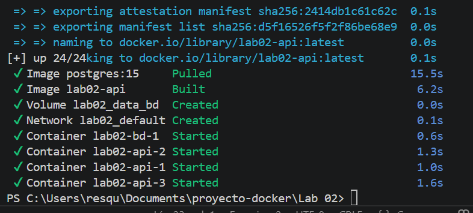

# Laboratario 02 - Docker Compose

Hoy utilizaremos docker compose para desplegar una API y base de datos.

## Stack

**API**
- Python (Minimal API nativa con `http.server`)
- Retorna un mensaje en formato JSON incluyendo mi nombre
- Dockererizado y configurado para correr con 3 réplicas

**BD**
- PostgreSQL 15

# Indicaciones

## Comandos

```bash
docker compose up -d
```
```bash
docker compose ps
```
```bash
docker compose down
```

## Configuración por entorno

- `DB_USER`: Usuario administrador de la base de datos.
- `DB_PASS`: Contraseña de la base de datos.
- `DB_NAME`: Nombre de la base de datos principal.

# Preguntas Teóricas

## 1. Tipos de redes en Docker
Los principales que existen son:
- **bridge:** Es la red por defecto. Sirve para que los contenedores se comuniquen entre sí en la misma máquina local.
- **host:** Le quita el aislamiento de red al contenedor y hace que use directamente la red de la computadora.
- **none:** Desactiva toda la conexión de red del contendor, dejándolo totalmente aislado.

## 2. Tipos de volúmenes en Docker
- **Volumes (Volúmenes nombrados):** Son administrados directamente por Docker. Son la mejor opción para guardar datos persistentes de forma segura.
- **Bind mounts:** Es cuando mapeas una ruta o carpeta específica de tu computadora hacia adentro del contenedor.
- **tmpfs:** Guarda los datos temporalmente en la memoria RAM; si el contenedor se detiene, la información se borra.
# Creditos
- Charles Rances Esquerre Martos
- 000291378





